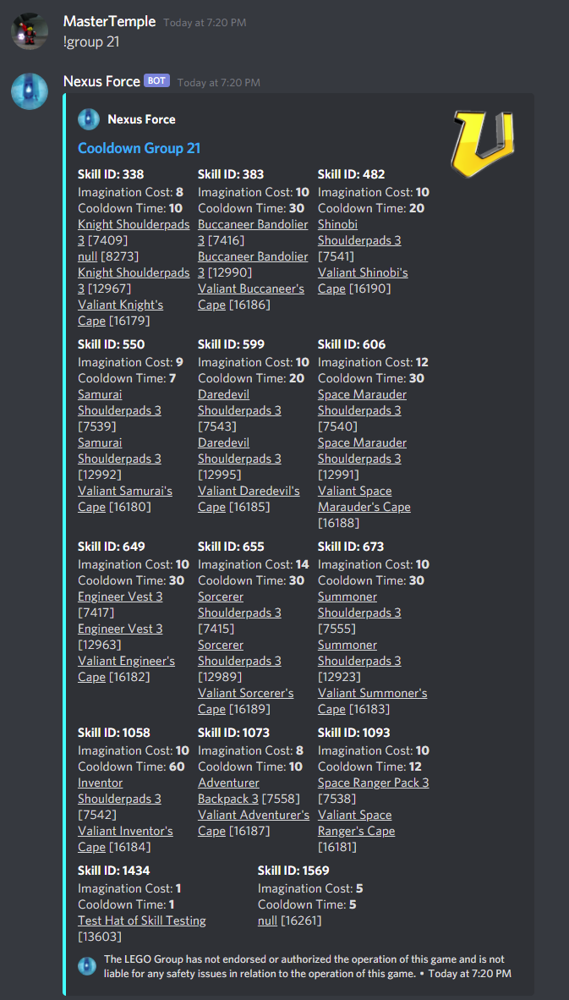
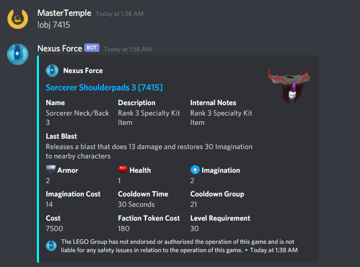
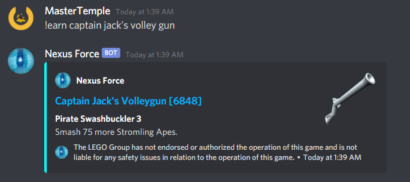
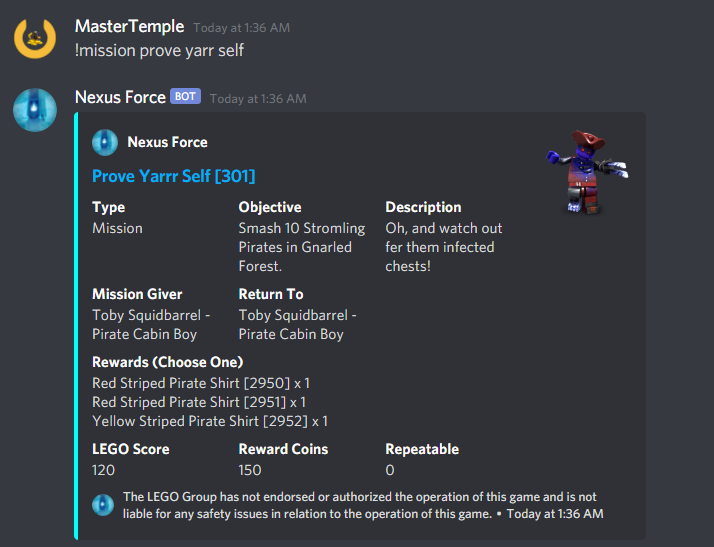
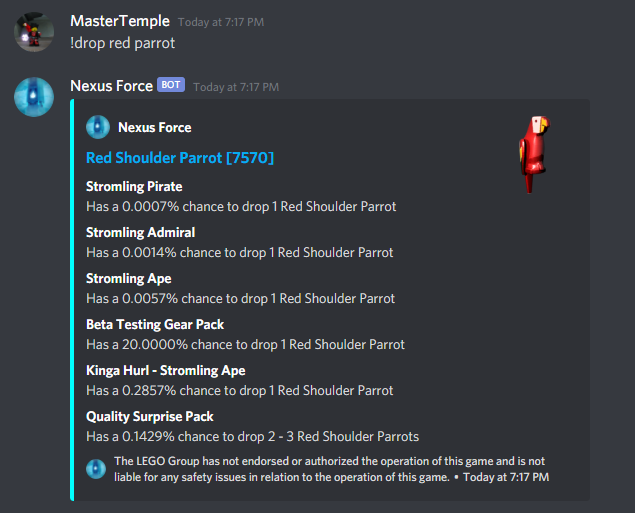
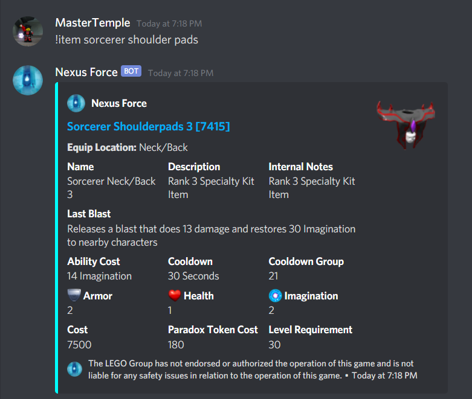
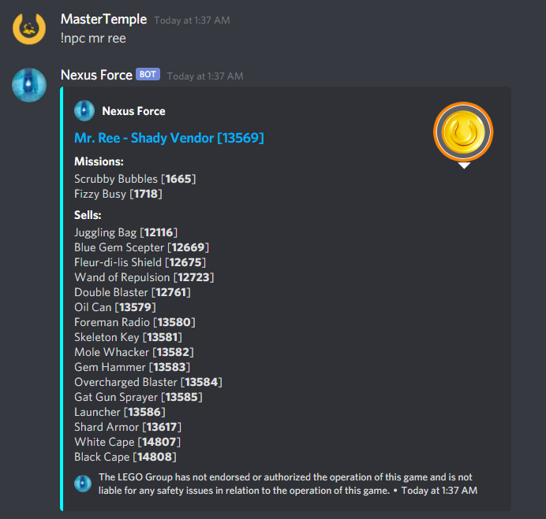

# NexusForce
Nexus Force LEGO Universe Bot

Installation
1. Download Node.js (see internet)
2. In terminal type `npm i discord.js`
3. Add a config.json file that looks like this
```yaml
   {
  "prefix": "!",
  "iconURL": "https://media.discordapp.net/attachments/641133444746838016/813621671461781544/circle-cropped_1.png",
  "inviteLink": "https://discord.com/api/oauth2/authorize?client_id=813618765685456916&permissions=52288&scope=bot",
  "token": "findYourOwnToken:)",
  "footer": "The LEGO Group has not endorsed or authorized the operation of this game and is not liable for any safety issues in relation to the operation of this game.",
  "botInfo": {
    "name": "Nexus Force",
    "version": 2
  },
  "excludeFromHelp": [
      "setpfp",
      "status",
      "play"
  ],
  "mythran": [
      "703120460023463986",
      "789705048035688458",
      "247557128913551360"
  ],
  "emojis": {
    "armor": "<:armor:820200969861857280>",
    "heart": "<:heart:820200969803268096>",
    "imagination": "<:imagination:820200969789767690>"
  },
  "startupStatus": "LEGO Universe"
}
   ```

4. Run index.js through your IDE or by typing `node index.js`

#Two Types of Commands:
1. Normal (Accessible by all users)\
Visible with !help command
   
2. Mythran (Accessible by only mythrans)\
Visible with !mythran command
   
#Issues:
For emojis to work you will need to update their location or ask me for the token so you can use this bot.
I am aware the weapon combos with some weapons are messed up (the charge up ones that do no damage)

#Some screenshots:
#!drop
\
#!obj
\
#!earn
\
#!buy
\
#!mission
\
#!level
\
#!brick
\
#!npc
\

