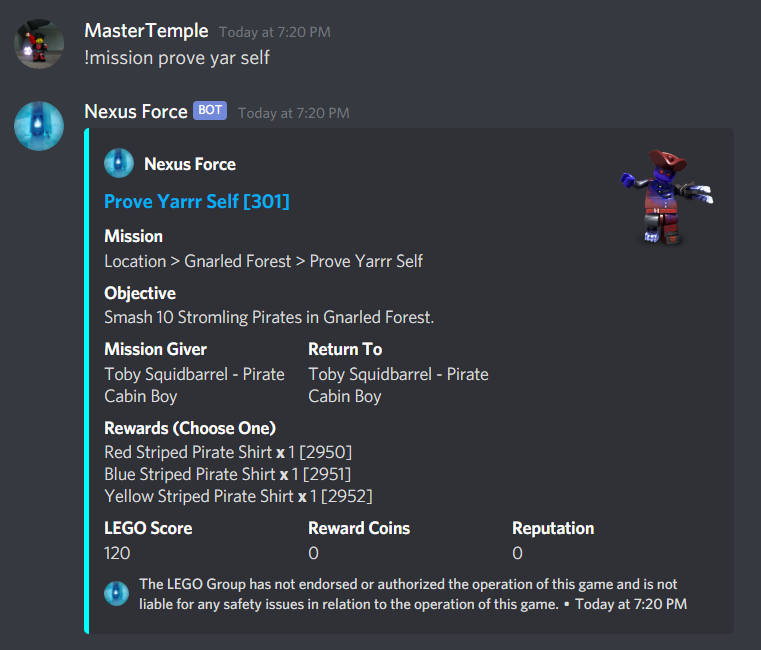
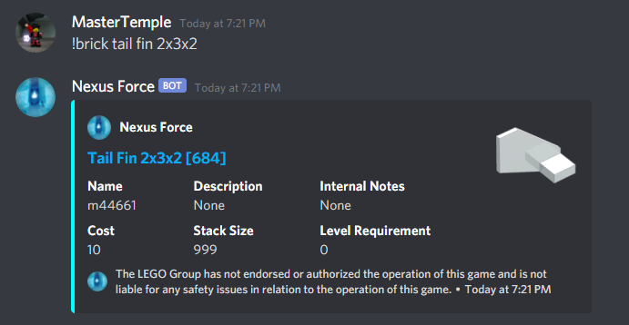
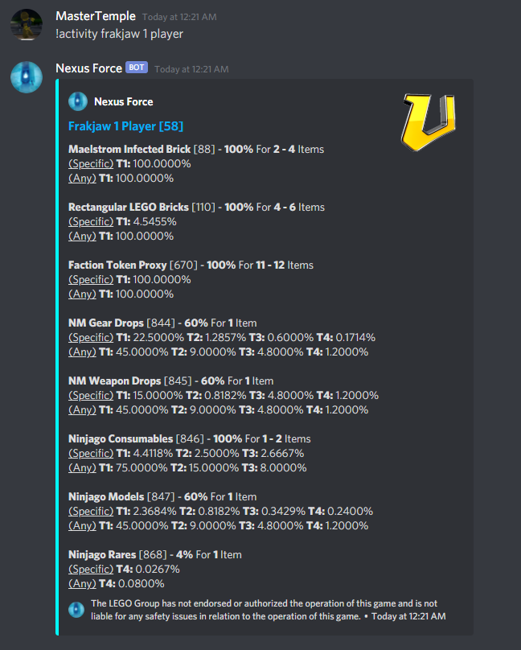
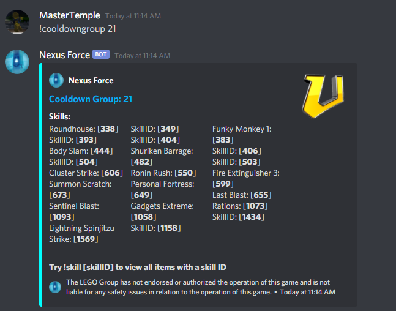

# NexusForce
Nexus Force LEGO Universe Bot

# Setup:
1. Download Node.js [here](https://nodejs.org/en/download/)
2. Download git [here](https://git-scm.com/download)
3. Paste `git clone https://github.com/MasterTemple/NexusForce.git` in terminal and hit enter
4. Next, type `cd NexusForce` to navigate to the proper directory.
5. Paste `npm i nodemon -g;npm i discord.js` to install Nodemon and Discord.js
6. Add a `config.json` to your current directory. The file should look exactly like this, except put in your own token.
```yaml
{
  "prefix": "!",
  "iconURL": "https://media.discordapp.net/attachments/641133444746838016/813621671461781544/circle-cropped_1.png",
  "inviteLink": "https://www.darkflameuniverse.org/",
  "token": "YOUR_TOKEN_GOES_HERE!!!",
  "footer": "The LEGO Group has not endorsed or authorized the operation of this game and is not liable for any safety issues in relation to the operation of this game.",
  "invisChar": "឵឵",
  "botInfo": {
    "name": "Nexus Force",
    "version": 3
  },
  "excludeFromHelp": [
    "object"
  ],
  "mythran": [
    "789705048035688458",
    "703120460023463986"
  ],
  "contributor": [
    "703120460023463986",
    "120841067791777792",
    "789705048035688458"
  ],
  "emojis": {
    "armor": "<:armor:820200969861857280>",
    "heart": "<:heart:820200969803268096>",
    "imagination": "<:imagination:820200969789767690>",
    "rarity1": "<:rarity1:828841598171217963>",
    "rarity2": "<:rarity2:828841597986799667>",
    "rarity3": "<:rarity3:828841598166499358>",
    "rarity4": "<:rarity4:828841598242521088>",
    "mythran": "<:mythran:834921599764398110>"
  },
  "startupStatus": "LEGO Universe"
}
   ```

7. Run `index.js` by typing `nodemon index.js` in your command line

# Three Types of Commands:
1. Normal (Accessible by all users)\
    Listed with the `!help` command
2. Contributor (Accessible by only contributors)\
   Listed with the `!contributor` command
3. Mythran (Accessible by only mythrans)\
   Listed with `!mythran` command
   
# Some screenshots:
# !kit

# !drop

# !package

# !enemydrop

# !item

# !earn

# !buy

# !mission

# !level

# !brick

# !npc

# !activity

# !loottableindex

# !preconditions

# !group

# !skill

# To Prevent Spam, Some Commands With Large Messages Are DMed To The User
Some of the content might be short, but it has the potential to be very long. To prevent abuse, the bot DM's the user the info.
# !skillitems
\


# Issues
I don't know if the server emojis will work if someone hosts this bot without it being in the server that contains these emojis. If not, contact me and I can help you set them up.


# Future
1. Enemy stats and attacks

# Contact
If you have any questions regarding use or any suggestions for features, feel free to contact me on Discord at `MasterTemple#0233` (my ID is `789705048035688458` just in case my name is changed). Find me in the [LEGO Universe Community Hub](https://discord.gg/Yz8yEmZ)!
