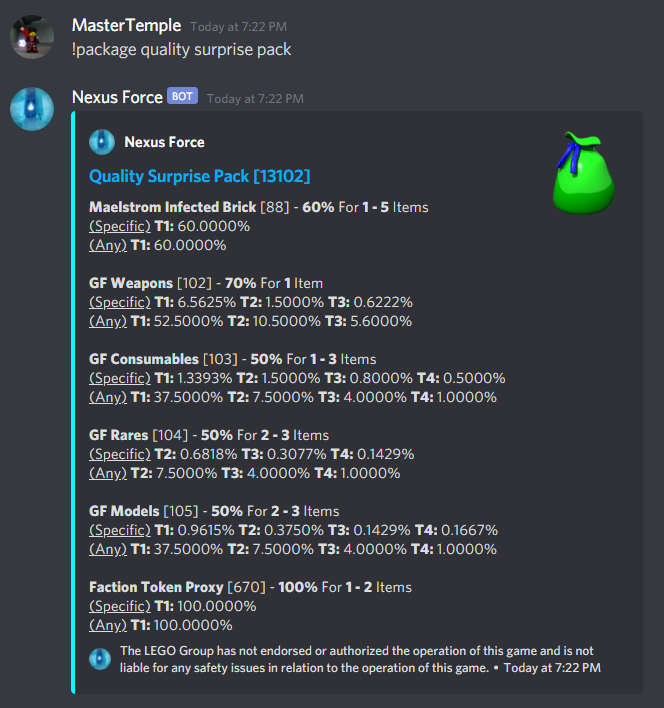
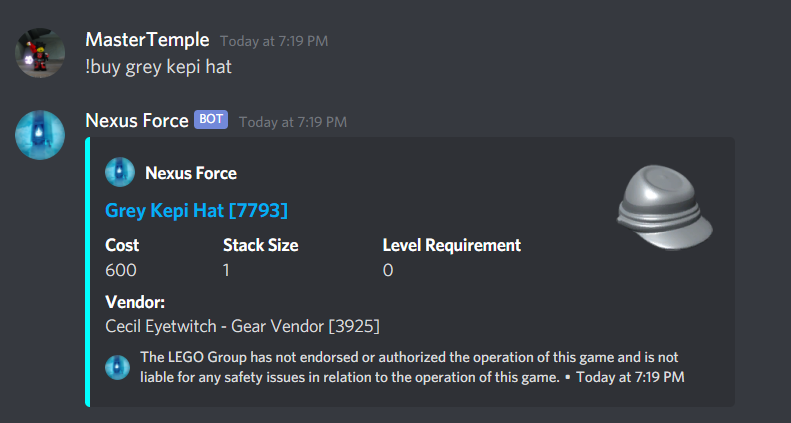

# NexusForce
Nexus Force LEGO Universe Bot

Installation/Setup:
1. Download Node.js (see internet)
2. In terminal type `npm i discord.js` and `npm i nodemon -g`
3. Add a `config.json` file that looks like this
```yaml
{
  "prefix": "!",
  "iconURL": "https://media.discordapp.net/attachments/641133444746838016/813621671461781544/circle-cropped_1.png",
  "inviteLink": "https://www.darkflameuniverse.org/",
  "token": "kepi",
  "footer": "The LEGO Group has not endorsed or authorized the operation of this game and is not liable for any safety issues in relation to the operation of this game.",
  "botInfo": {
    "name": "Nexus Force",
    "version": 3
  },
  "excludeFromHelp": [
      "object"
  ],
  "mythran": [
      "703120460023463986",
      "789705048035688458",
      "247557128913551360"
  ],
  "contributor": [
      "703120460023463986",
      "120841067791777792",
      "789705048035688458"
  ],
  "emojis": {
    "armor": "<:armor:820200969861857280>",
    "heart": "<:heart:820200969803268096>",
    "imagination": "<:imagination:820200969789767690>",
    "rarity1": "<:rarity1:828841598171217963>",
    "rarity2": "<:rarity2:828841597986799667>",
    "rarity3": "<:rarity3:828841598166499358>",
    "rarity4": "<:rarity4:828841598242521088>"
  },
  "startupStatus": "LEGO Universe"
}
   ```

4. Run `index.js` by typing `nodemon index.js` in your command line

# Three Types of Commands:
1. Normal (Accessible by all users)\
    Visible with `!help` command
   
2. Contributor (Accessible by only contributors)\
   Visible with the `!contributor` command
3. Mythran (Accessible by only mythrans)\
    Visible with `!mythran` command
   
# Issues:
I don't know if the stat emojis will work if someone hosts this bot without it being in the server that contains these emojis.\

# Some screenshots:
# !kit

# !drop

# !package

# !enemydrop

# !item

# !earn

# !buy

# !mission

# !level

# !brick

# !npc

# !group


# Future
1. Enemy stats and attacks

# Contact
If you have any questions regarding use or any suggestions for features, feel free to contact me on Discord at `MasterTemple#0233` (my ID is `789705048035688458` just in case my name is changed)
